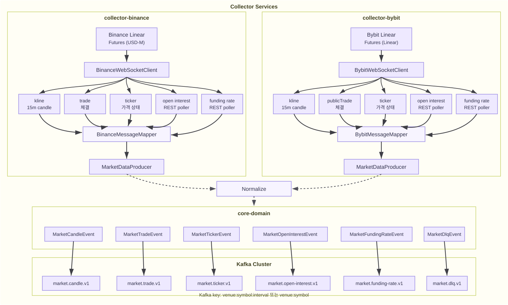

# Market Data Platform

> **코인 선물 시장 데이터를 수집해 공통 이벤트로 정규화하고 Kafka로 발행하는 실시간 데이터 수집 플랫폼**

Binance USD-M Futures와 Bybit Linear의 시장 데이터를 수집해 공통 도메인 이벤트로 정규화하고 Kafka 토픽으로 발행합니다.  
최종 목표는 거래소별 WebSocket/REST 응답을 내부 표준 이벤트로 변환해, 뒤쪽 서비스가 거래소 API 차이를 몰라도 동일한 Kafka 토픽을 소비할 수 있게 만드는 것입니다.


## 1. 최종 구조

> 최종적으로 이 프로젝트는 거래소 API 차이를 숨기고, 표준화된 시장 데이터 이벤트를 Kafka로 발행하는 수집 계층이 됩니다.



```text
Exchange WebSocket / REST
        ↓
Collector Services
        ↓
Normalize
        ↓
Kafka Topics
```

| 계층 | 역할 |
| --- | --- |
| Collector Services | 거래소별 WebSocket/REST 연결, 구독, DTO 파싱, 재연결, Kafka 발행 |
| core-domain | 시장 데이터 공통 이벤트와 Kafka 토픽 계약 제공 |
| Kafka Cluster | 데이터 타입별 토픽으로 이벤트 전달 |


## 2. 수집 대상

> 이 데이터 수집 플랫폼은 거래소별 데이터 수집과 표준화된 이벤트 발행만 담당합니다.

| 데이터 | 역할 |
| --- | --- |
| Kline | OHLCV 기반 차트와 기술적 지표 계산의 기준 데이터 |
| Trade | 실시간 체결 흐름과 매수·매도 모멘텀 판단 |
| Ticker / Mark Price / Index Price | 현재가, 선물 기준가, 지수 가격 기반 시장 상태 확인 |
| Open Interest | 신규 포지션 유입과 포지션 청산 흐름 판단 |
| Funding Rate | 롱/숏 과열과 파생시장 쏠림 판단 |


## 3. Modules

```text
market-data-platform/
├── core-domain/                 # 공통 이벤트 / Kafka 토픽 계약
├── binance-collector-service/   # Binance USD-M Futures 수집
├── bybit-collector-service/     # Bybit Linear 수집
├── docker-compose.yml           # 로컬 Kafka 실행
├── build.gradle
└── settings.gradle
```

| 모듈 | 책임 | 현재 상태 |
| --- | --- | --- |
| `core-domain` | `MarketCandleEvent`, `MarketDlqEvent`, Kafka topic 상수 관리 | 구현됨 |
| `binance-collector-service` | Binance USD-M Futures WebSocket Kline 수집, 정규화, Kafka 발행 | Kline 구현 / 통합 검증 대기 |
| `bybit-collector-service` | Bybit Linear WebSocket Kline 수집, 정규화, Kafka 발행 | Kline 구현 / 통합 검증 대기 |


## 4. Kafka Topics

> Kafka topic은 거래소 기준이 아니라 데이터 타입 기준으로 구성합니다. 거래소 구분은 topic이 아니라 이벤트 내부의 `provider`, `venue` 값으로 처리합니다.

| Topic | Event | 용도 | 상태 |
| --- | --- | --- | --- |
| `market.candle.v1` | `MarketCandleEvent` | Kline/Candle 데이터 발행 | 구현됨 |
| `market.trade.v1` | 예정 | 실시간 체결 데이터 발행 | 예정 |
| `market.ticker.v1` | 예정 | 현재가, Mark Price, Index Price 발행 | 예정 |
| `market.open-interest.v1` | 예정 | Open Interest 데이터 발행 | 예정 |
| `market.funding-rate.v1` | 예정 | Funding Rate 데이터 발행 | 예정 |
| `market.dlq.v1` | `MarketDlqEvent` | 파싱·검증 실패 이벤트 발행 | 구현됨 |


## 5. Data Flow

> Binance와 Bybit의 원본 JSON 구조는 다르지만, Kafka에 들어가는 이벤트는 동일한 형태를 유지합니다.

```text
Provider WebSocket
  → Provider DTO
  → Message Mapper
  → Common Domain Event
  → Kafka Topic
  → Downstream Services
```

```text
Binance USD-M Futures Kline JSON
        ↓
BinanceMessageMapper
        ↓
MarketCandleEvent
        ↓
market.candle.v1
```

```text
Bybit Linear Kline JSON
        ↓
BybitMessageMapper
        ↓
MarketCandleEvent
        ↓
market.candle.v1
```


## 6. 문서

> 구현 범위와 완료 기준은 별도 문서에서 관리합니다.

| 문서                                                           | 내용 |
|--------------------------------------------------------------| --- |
| [Collector MVP 1.0.0](docs/collector/collector-mvp-1.0.0.md) | 1차 MVP 세부 범위, Kafka key, 이벤트 계약, 완료 기준 |


## 7. Quick Start

### Kafka 실행

```bash
docker compose up -d
```

### 빌드

```bash
./gradlew clean build
```

### Collector 실행

```bash
./gradlew :binance-collector-service:bootRun
./gradlew :bybit-collector-service:bootRun
```

### Kafka 이벤트 확인

```bash
docker exec -it kafka kafka-console-consumer \
  --bootstrap-server localhost:9092 \
  --topic market.candle.v1 \
  --from-beginning
```


## 8. Roadmap

### MVP 1.0 — Candle Ingestion

- [x] 데이터 타입 기준 Kafka topic 구조 정의
- [x] `MarketCandleEvent` 계약 정의
- [x] `MarketDlqEvent` 계약 정의
- [x] Binance USD-M Futures Kline WebSocket 수집
- [x] Binance Kline → `MarketCandleEvent` 정규화
- [x] Binance candle 이벤트 `market.candle.v1` 발행
- [x] Bybit Linear Kline WebSocket 수집
- [x] Bybit Kline → `MarketCandleEvent` 정규화
- [x] Bybit candle 이벤트 `market.candle.v1` 발행
- [x] Binance Kline mapper 테스트
- [x] Bybit Kline mapper 테스트
- [ ] 실제 Kafka 환경에서 Binance candle 이벤트 확인
- [ ] 실제 Kafka 환경에서 Bybit candle 이벤트 확인

### MVP 1.1 — Trade / Ticker

- [ ] `MarketTradeEvent`
- [ ] `MarketTickerEvent`
- [ ] Binance Trade WebSocket 수집
- [ ] Trade → `MarketTradeEvent` 정규화
- [ ] `market.trade.v1` 발행
- [ ] Binance Ticker / Mark Price / Index Price 수집
- [ ] Ticker → `MarketTickerEvent` 정규화
- [ ] `market.ticker.v1` 발행
- [ ] Bybit Trade WebSocket 수집
- [ ] Trade → `MarketTradeEvent` 정규화
- [ ] `market.trade.v1` 발행
- [ ] Bybit Ticker / Mark Price / Index Price 수집
- [ ] Ticker → `MarketTickerEvent` 정규화
- [ ] `market.ticker.v1` 발행

### MVP 1.2 — Derivatives Data

- [ ] `MarketOpenInterestEvent`
- [ ] `MarketFundingRateEvent`
- [ ] Binance Open Interest REST 수집
- [ ] Open Interest → `MarketOpenInterestEvent` 정규화
- [ ] `market.open-interest.v1` 발행
- [ ] Binance Funding Rate REST 수집
- [ ] Funding Rate → `MarketFundingRateEvent` 정규화
- [ ] `market.funding-rate.v1` 발행
- [ ] Bybit Open Interest REST 수집
- [ ] Open Interest → `MarketOpenInterestEvent` 정규화
- [ ] `market.open-interest.v1` 발행
- [ ] Bybit Funding Rate REST 수집
- [ ] Funding Rate → `MarketFundingRateEvent` 정규화
- [ ] `market.funding-rate.v1` 발행
